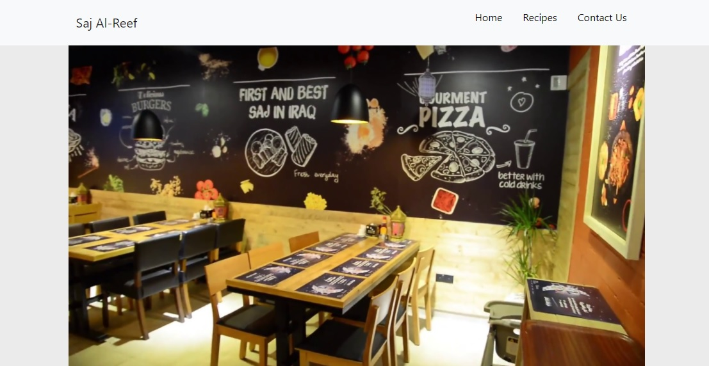

# Restaurant Page

> This app was built via Javascript and webpack to create pagination between different parts of it.



<p align='center'><small>A user interface screenshot</small></p><br /><br />

## Built With

- HTML5
- CSS3
- JavaScript
- Webpack

## Dependencies

- Webpack
- Style loader
- CSS loader
- File loader
- Image webpack loader
- Babel

## Live Demo

[Live Demo](https://rawcdn.githack.com/martinnajjar12/restaurant-page/4af1e3a6044c239f7ebaf7884709a2f2f664cd7f/dist/index.html)

## Getting Started

To get a local copy up and running follow these simple example steps.

### Prerequisites

- Node.js

### Setup

<p>Clone this repo either by typing `git clone https://github.com/martinnajjar12/restaurant-page` (You must have git installed on your local machine in this case) or download a zip version of the code from GitHub.</p>

<p>Instal the dependencies with:</p>

```
  npm install
```

### Usage

Compile the code by typing the following command in your terminal (Make sure your in the root directory of your project):

```
  npm run start
```

Now double-click `index.html` which is in the `dist` folder to open it in your browser.

## Author: Martin Najjar

- Github: [@martinnajjar12](https://github.com/martinnajjar12)
- Twitter: [@martin_najjar](https://twitter.com/martin_najjar)
- LinkedIn: [Martin Najjar](https://www.linkedin.com/in/martinnajjar12/)

## 🤝 Contributing

Contributions, issues and feature requests are welcome!

Feel free to check the [issues page](https://github.com/martinnajjar12/restaurant-page/issues).

## Show your support

Give a ⭐️ if you like this project!

## Acknowledgments

Microverse and The Odin Porject.

### 📝 License

This project is [MIT](https://github.com/martinnajjar12/restaurant-page/blob/development/LICENSE) licensed.
